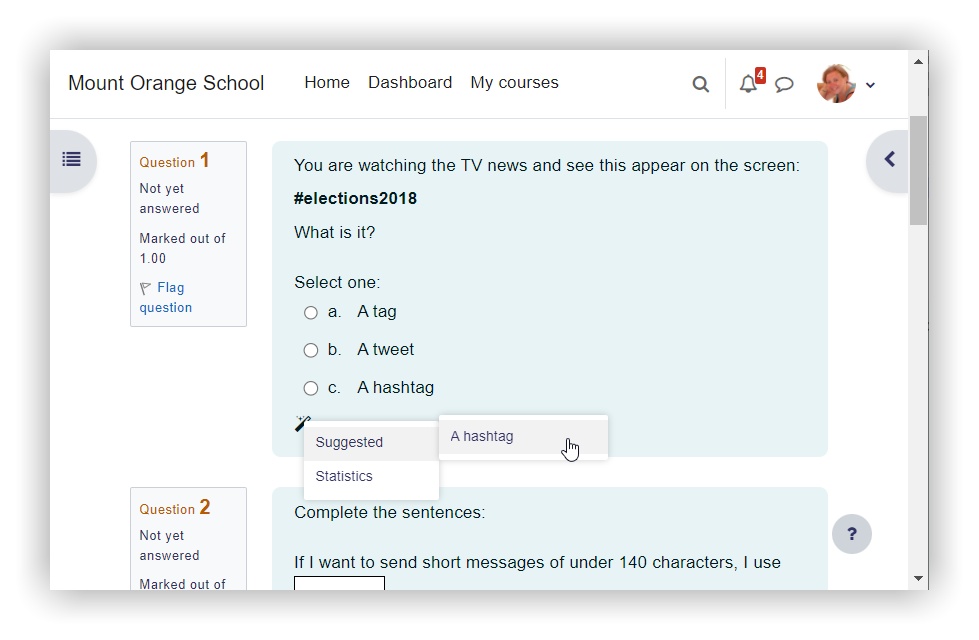
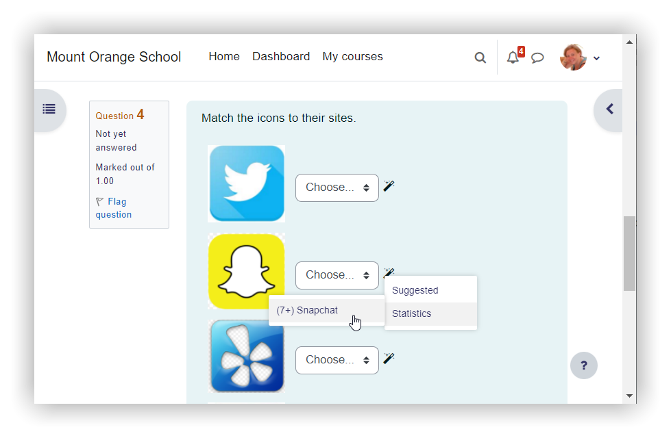
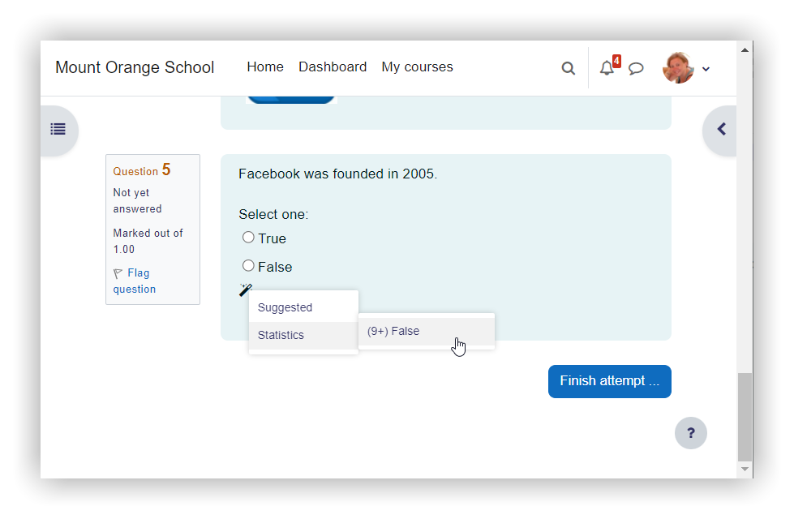

# ReShare
Форк SyncShare с открытым кодом

[Исходный репозиторий](https://github.com/F1Soda/syncshare-extension), [Сайт SyncShare](https://syncshare.naloaty.me/)
## Предпосылки
В SyncShare было довольно муторно вручную нажимать на ответы, особенно, если тестов приходится решать много. Добавить автокликер как будто бы очевидная мысль, однако исходики SyncShare недоступны. В репозитории, который мне удалось найти, была устаревшая версия API и домен.

Мне удалось довести те исходники до рабочего состояния, то есть создать полностью опенсорсную копию SyncShare. После этого добавить автоклик не составляло труда.

## Нагрузка на сервера
Нагрузка на сервера SyncShare является известной проблемой, это было одной из причин, по которой создатели SyncShare не добавляли автокликер.

ReShare сам нажимает ответы и делает это с задержками, таким образом нагрузка на сервера SS, которую создаёт ReShare, сравнима с той, которую создаёт SyncShare с ручным вводом ответов.

## Античит
Согласно информации, которую мне сообщила команда SyncShare, некоторые ВУЗы умеют определять включённое расширение. Как именно это происходит, у меня информации нет, по этому в данном направлении никаких исправлений пока нет.
## Screenshots

|  |  |  |
| --- | --- | --- |

